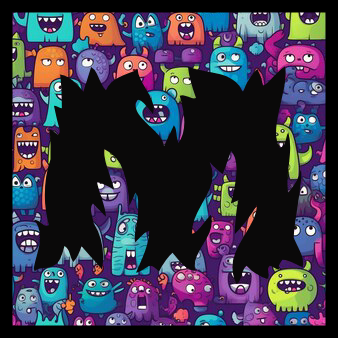

#   Monster memory 
Juego online de emparejamiento de cartas realizado en Android Studio con Java y Firebase (realtime y database).

## 📄 Descripción
App realizada durante el segundo año de Grado Superior de Desarrollo de Aplicaciones Multiplataforma + Perfil videojuegos y ocio digital (DAMvi).

➕ _Incluye:_
- Online 2 jugadores (_Firebase realtime_ y _database_).
- Base de datos también local.
- Ranking global por puntuación.
- Generador y cambio de nicknames.
- Notificaciones.
- Modo claro y oscuro.
- Feedback al usuario.

## 🎯 Objetivo del juego y funcionamiento
El juego consiste en emparejar a los monstruos y conseguir la mayor puntuación.

- Por cada pareja correcta: 2 puntos, a la cual se le sumará la racha multiplicada por 2.
- Si emparejas dos cartas incorrectas, la racha se reinicia.

## 💻 Tecnologías

## 📽️ App en funcionamiento (clic en la imagen para ver el vídeo)

## ©️ Créditos
- Desarrollo: Selene Milanés.
- Monstruos por [Tetiana Lazunova](https://www.istockphoto.com/es/vector/monstruos-de-dibujos-animados-lindo-personajes-halloween-monstruo-alegre-divertido-gm1009886320-272229571).
- Imagen de fondo del menú por [Kira L. Nguyen](https://www.behance.net/gallery/29875189/Mobile-Game-Background-1).

 
 
No dudes en contactarme para cualquier duda o inquietud  

